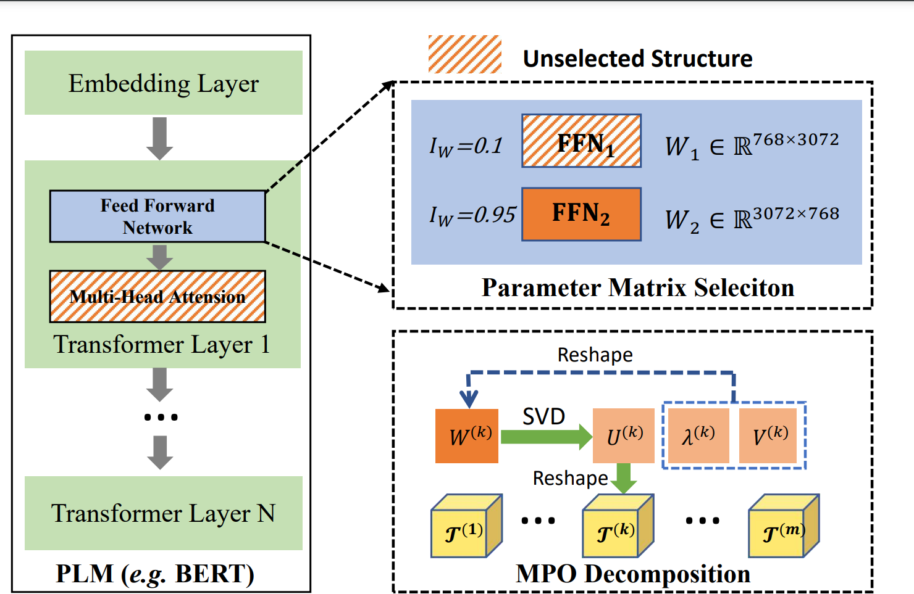

# Over-Parameter Framework
This is our Pytorch implementation for the paper:
> Ze-Feng Gao, Kun Zhou, Peiyu Liu, Wayne Xin Zhao, Ji-Rong Wen. Small Pre-trained Language Models Can be Fine-tuned as Large Models via Over-Parameterization. (ACL 2023)
# Introduction
With the help of more parameters, large pre-trained language models (PLMs) have shown remarkable performance in various natural language processing tasks, mostly outperforming small PLMs by a large margin.
However, due to the high computational cost, the enormous number of parameters also restricts the applicability of large PLMs in the community.
In this paper, we focus on just scaling up the parameters of PLMs during fine-tuning, to benefit from the over-parameterization but not increasing the inference latency.
Given a relatively small PLM, we over-parameterize it by employing a matrix product operator, an efficient and almost lossless decomposition method to factorize its contained parameter matrices into a set of higher-dimensional tensors.
Considering the efficiency, we further propose static and dynamic strategies to select the most important parameter matrices for over-parameterization.
 
Extensive experiments have demonstrated that our approach can significantly boost the fine-tuning performance of small PLMs and even help small PLMs outperform $3\times$ parameterized larger ones.
## Release Notes
- First version: 2023/05/08

## Requirements
- python >= 3.7.x
- torch >= 1.8.0

## How to run?

Just run the script focusing on the following 2 scripts.

 - To run BERT finetuning model:
   ```
   cd bert
   bash run_bert_fine_tune.sh
   ```

 - To run BART finetuning model:
   ```
   cd bart
   bash run_bart_fine_tune.sh
   ```
 - To run T5 finetuning model:
   ```
   cd t5
   bash run_t5_fine_tune.sh
   ```


## Samples of bash file.
```shell
# basline
run_task 8 MRPC 500 2e-5 3.0 32 mprc_base 128 2.8e-6 nompo 1000 1000 1000 bert-base-uncased Noload noupdate --do_train\ --metric_for_best_model="acc"\ --eval_steps=500
# select top-N
# (1) define SHAPE_CONFIG，position in：bert/trainer_bert_4.py：line 104
# (2) Run the following command
# static selection topN
run_task 0 MRPC 500 2e-5 3.0 32 mprc_base_top5 128 2.8e-6 nompo 1000 1000 1000 bert-base-uncased Noload noupdate --do_train\ --metric_for_best_model="acc"\ --eval_steps=500\ --mode=ChildTuning-D\ --topN=6\ --weight_types=FFN_1,FFN_2,attention
# dynamic selection topN
run_task 0 MRPC 500 2e-5 3.0 32 mprc_base_top5_splitnum2 128 2.8e-6 nompo 1000 1000 1000 bert-base-uncased Noload noupdate --do_train\ --metric_for_best_model="acc"\ --eval_steps=500\ --mode=ChildTuning-D\ --topN=6\ --weight_types=FFN_1,FFN_2,attention\ --dynamic_decom\ --split_num=2
```
Important arguments:
```
--data_dir          
Path to load dataset
--mpo_lr            
Learning rate of tensors produced by MPO
--mpo_layers        
Name of components to be decomposed with MPO
--emb_trunc         
Truncation number of the central tensor in word embedding layer
--update_mpo_layer  
Name of components to be update when training the model
--mode  
Selecting "ChildTuning-D" means that one round of structural screening is performed before training begins.
--topN  
Indicates the selection of the first N large structures, taking values in the range [0,L].
- weight_types
Indicates the type of structure implemented by the over-parameterization process, choose "FFN_1,FFN_2,attention" or one "FFN_1" and so on.
- dynamic_decom
Whether to use dynamic selection strategy. 
NOTE: Use dynamic selection strategy but split_num=1 is equivalent to static selection strategy.
- split_num:int, 
Select the over-parameterized structure several times. e.g., topN=6, split_num=2, num_epoch=3, then topN=3 at epoch=0, 2 (math.ceil(3/2)=2) respectively.
Note: The topN must be divisible by split_num.
```


## Acknowledgment
Any scientific publications that use our codes should cite the following paper as the reference:
```
@inproceedings{Gao-acl-2023,
  author    = {Ze{-}Feng Gao and
               Kun Zhou and
               Peiyu Liu and
               Wayne Xin Zhao and
               Ji{-}Rong Wen},
  title     = "Small Pre-trained Language Models Can be Fine-tuned as Large Models via Over-Parameterization.",
  booktitle = {{ACL}},
  year      = {2023},
}
```


# 
This repo contains the PyTorch implementation of OPF based on repo "Parameter-Efficient Mixture-of-Experts Architecture for Pre-trained Language Models".[ref](https://aclanthology.org/2022.coling-1.288.pdf) and "Raise a Child in Large Language Model: Towards Effective and Generalizable Fine-tuning".
[ref](https://arxiv.org/pdf/2109.05687.pdf) 

